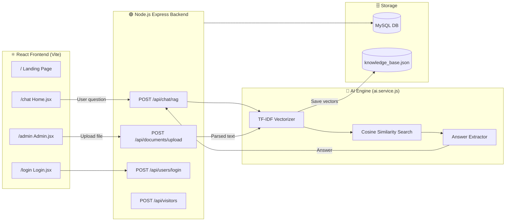
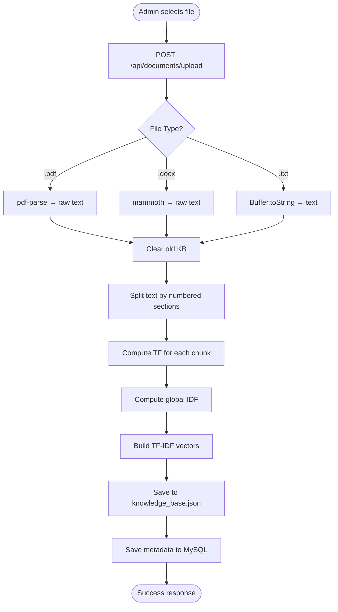
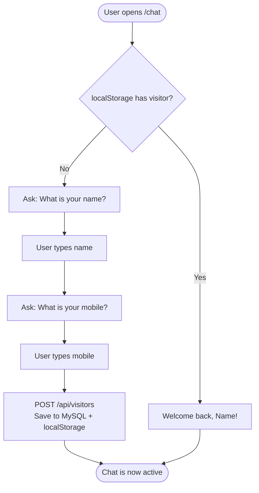
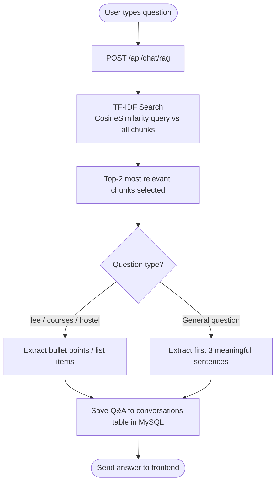
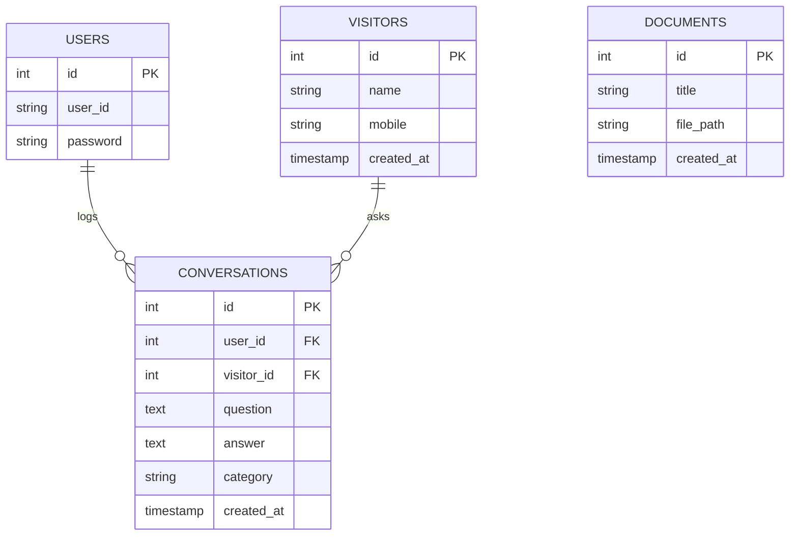

# 🎓 AI Campus Guide — Complete Project Analysis

> **Project Type:** AI Chatbot using TF-IDF Retrieval System  
> **Stack:** React (Frontend) + Node.js/Express (Backend) + MySQL (Database)  
> **ML Technique:** TF-IDF + Cosine Similarity (No external ML library needed)

---

## 📁 Full Project Structure

```
chat_bot_project/
├── backend/
│   ├── server.js              ← Entry point. DB connect + auto-load documents
│   ├── app.js                 ← Express setup, routes registration
│   ├── .env                   ← API keys, DB credentials, Port
│   ├── knowledge_base.json    ← Persisted AI knowledge (auto-generated)
│   ├── config/
│   │   ├── db.config.js       ← MySQL connection pool
│   │   └── env.config.js      ← Loads environment variables
│   ├── controllers/
│   │   ├── chat.controller.js     ← Handles /chat/basic and /chat/rag
│   │   ├── document.controller.js ← Handles file upload + parsing
│   │   ├── user.controller.js     ← Admin login / logout / verify
│   │   └── visitor.controller.js  ← Visitor registration
│   ├── models/
│   │   ├── user.model.js          ← Admin user DB queries
│   │   ├── conversation.model.js  ← Chat history DB queries
│   │   ├── document.model.js      ← Uploaded documents DB queries
│   │   └── visitor.model.js       ← Campus visitors DB queries
│   ├── routes/
│   │   ├── chat.routes.js         ← POST /chat/basic, /chat/rag
│   │   ├── document.routes.js     ← POST /documents/upload, DELETE /documents/clear
│   │   ├── user.routes.js         ← POST /users/login, /logout, GET /verify
│   │   └── visitor.routes.js      ← POST/GET /visitors
│   ├── services/
│   │   └── ai.service.js          ← ⭐ TF-IDF ML Engine (core brain)
│   └── uploads/               ← Uploaded documents stored here
│
└── frontend/
    ├── index.html
    ├── vite.config.js
    ├── tailwind.config.js
    └── src/
        ├── main.jsx               ← React entry point
        ├── App.jsx                ← Router + Auth check
        ├── pages/
        │   ├── Landing.jsx        ← Homepage / hero page
        │   ├── Home.jsx           ← 💬 Main chat interface
        │   ├── Admin.jsx          ← 📁 Document upload panel
        │   └── Login.jsx          ← Admin login form
        ├── services/
        │   └── api.service.js     ← All Axios API calls
        └── components/
            ├── common/Navbar.jsx
            ├── LineWave.jsx
            └── VoiceVisualizer.jsx
```

---

## 🔄 System Architecture



---

## 🚀 How the Project Works — Step by Step

### 1️⃣ Server Startup ([server.js](file:///d:/personal/chat_bot_project/backend/server.js))
1. Connects to MySQL database
2. Checks if [knowledge_base.json](file:///d:/personal/chat_bot_project/backend/knowledge_base.json) already exists (was saved before)
3. If yes → loads and rebuilds TF-IDF index in memory (fast!)
4. If no → checks DB for uploaded document file paths, re-parses them
5. Starts Express server on configured PORT

---

### 2️⃣ Admin Uploads a Document ([Admin.jsx](file:///d:/personal/chat_bot_project/frontend/src/pages/Admin.jsx) → [document.controller.js](file:///d:/personal/chat_bot_project/backend/controllers/document.controller.js))



---

### 3️⃣ TF-IDF ML Engine ([ai.service.js](file:///d:/personal/chat_bot_project/backend/services/ai.service.js))

This is the **Machine Learning core** of the project.

#### Step A — Tokenization
```
"What is the Hostel Fee for students?"
→ ["what", "hostel", "fee", "students"]  (stop words removed)
```

#### Step B — Term Frequency (TF)
```
Measures: how often a word appears in ONE chunk
TF(word) = count(word in chunk) / total words in chunk
```

#### Step C — Inverse Document Frequency (IDF)
```
Measures: how RARE a word is across ALL chunks
IDF(word) = log( (N+1) / (chunks containing word + 1) ) + 1

Rare words → HIGH IDF → More important for search
Common words → LOW IDF → Less important
```

#### Step D — TF-IDF Vector
```
TFIDF(word, chunk) = TF × IDF
Each chunk becomes a vector of numbers representing its meaning.
```

#### Step E — Cosine Similarity Search
```
Query → TF-IDF vector
Compare with all chunk vectors using cosine angle formula
Score near 1.0 = very similar meaning
Score near 0.0 = no relation
→ Return top-2 most relevant chunks
```

---

### 4️⃣ Visitor Onboarding ([Home.jsx](file:///d:/personal/chat_bot_project/frontend/src/pages/Home.jsx))



---

### 5️⃣ RAG Chat Flow ([Home.jsx](file:///d:/personal/chat_bot_project/frontend/src/pages/Home.jsx) → [chat.controller.js](file:///d:/personal/chat_bot_project/backend/controllers/chat.controller.js) → [ai.service.js](file:///d:/personal/chat_bot_project/backend/services/ai.service.js))



---

### 6️⃣ Admin Authentication ([Login.jsx](file:///d:/personal/chat_bot_project/frontend/src/pages/Login.jsx) → [user.controller.js](file:///d:/personal/chat_bot_project/backend/controllers/user.controller.js))

| Step | What Happens |
|---|---|
| 1 | Admin enters `user_id` + `password` |
| 2 | Backend looks up user in MySQL |
| 3 | On match → generates JWT (24h expiry) |
| 4 | Sets `httpOnly` cookie on browser |
| 5 | Frontend stores auth state |
| 6 | All `/admin` routes protected by `Navigate to="/login"` |
| 7 | On page reload → [verifySession()](file:///d:/personal/chat_bot_project/frontend/src/services/api.service.js#47-51) checks JWT cookie |

---

## 🌐 Complete API Reference

| Method | Endpoint | Auth | Purpose |
|---|---|---|---|
| `POST` | `/api/chat/basic` | No | Direct OpenAI chat (no KB) |
| `POST` | `/api/chat/rag` | No | TF-IDF + KB-based answer |
| `POST` | `/api/documents/upload` | No* | Upload PDF/DOCX/TXT |
| `DELETE` | `/api/documents/clear` | No* | Clear knowledge base |
| `POST` | `/api/users/login` | No | Admin login → JWT cookie |
| `POST` | `/api/users/logout` | Yes | Clear JWT cookie |
| `GET` | `/api/users/verify` | Yes | Check JWT session |
| `POST` | `/api/visitors` | No | Register visitor |
| `GET` | `/api/visitors` | No | List all visitors |

> *Note: Document routes should be protected with auth middleware in production.

---

## 🗄️ Database Schema



---

## ✅ Project Completion Status

| Module | Status | Notes |
|---|---|---|
| React Frontend | ✅ Complete | Landing, Chat, Admin, Login pages |
| Express Backend | ✅ Complete | All routes, controllers working |
| MySQL Database | ✅ Complete | 4 tables: users, visitors, conversations, documents |
| Document Upload | ✅ Complete | PDF, DOCX, TXT supported |
| TF-IDF ML Engine | ✅ Complete | Upgraded from keyword scoring |
| Admin Auth (JWT) | ✅ Complete | Cookie-based, 24h session |
| Visitor Registration | ✅ Complete | localStorage + DB persistence |
| Voice Input | ✅ Complete | Web Speech API integrated |
| Knowledge Persistence | ✅ Complete | [knowledge_base.json](file:///d:/personal/chat_bot_project/backend/knowledge_base.json) survives restarts |

### ⚠️ Things to Check / Improve Before Submission

| Item | Priority | Fix |
|---|---|---|
| Document routes have no auth guard | 🔴 High | Add JWT middleware to `/documents/upload` and `/documents/clear` |
| Password stored as plain text | 🔴 High | Use `bcrypt` to hash passwords |
| No [.env](file:///d:/personal/chat_bot_project/backend/.env) file validation | 🟡 Medium | Add check if `OPENAI_API_KEY`, `DB_HOST` etc. are missing |
| `API_URL` is hardcoded in frontend | 🟡 Medium | Move to `.env.local` in Vite |
| No rate limiting | 🟡 Medium | Add `express-rate-limit` to `/chat/rag` |
| admin document route has no auth | 🔴 High | Anyone can upload/clear documents |

---

## 🔧 How to Run the Project

### Backend
```bash
cd backend
npm install --legacy-peer-deps
# Make sure .env has: DB_HOST, DB_USER, DB_PASS, DB_NAME, PORT, JWT_SECRET
npm run dev
```

### Frontend
```bash
cd frontend
npm install
npm run dev
```

---

## 🎤 Viva / Interview Talking Points

| Question | Answer |
|---|---|
| **What ML technique did you use?** | TF-IDF (Term Frequency-Inverse Document Frequency) with Cosine Similarity for semantic retrieval |
| **Why TF-IDF over keyword search?** | TF-IDF understands term importance across the corpus; keywords fail when wording differs |
| **What is RAG?** | Retrieval-Augmented Generation — retrieve relevant context first, then generate an answer from it |
| **How is auth implemented?** | JWT tokens stored as httpOnly cookies, verified on each session |
| **How does document persistence work?** | Parsed chunks saved to [knowledge_base.json](file:///d:/personal/chat_bot_project/backend/knowledge_base.json); TF-IDF index rebuilt on server restart |
| **What is Cosine Similarity?** | Measures the angle between two vectors — closer to 1.0 means more similar meaning |
