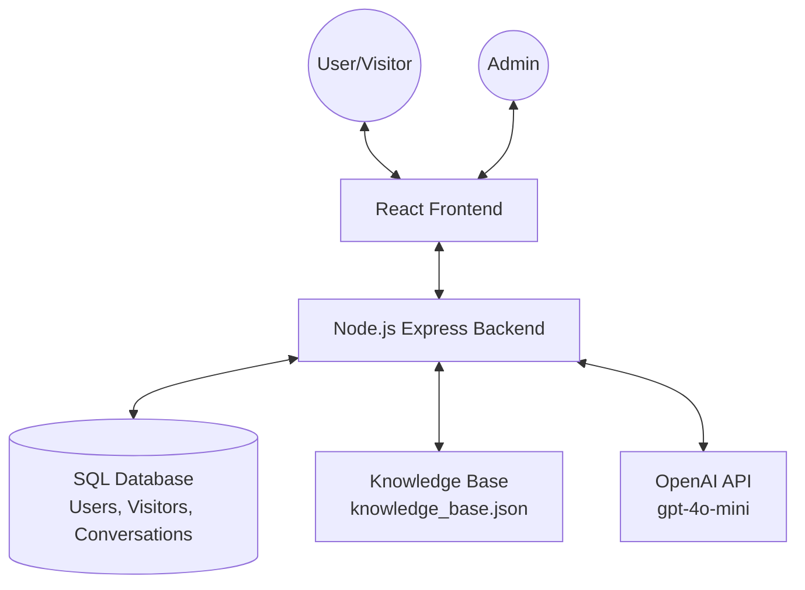
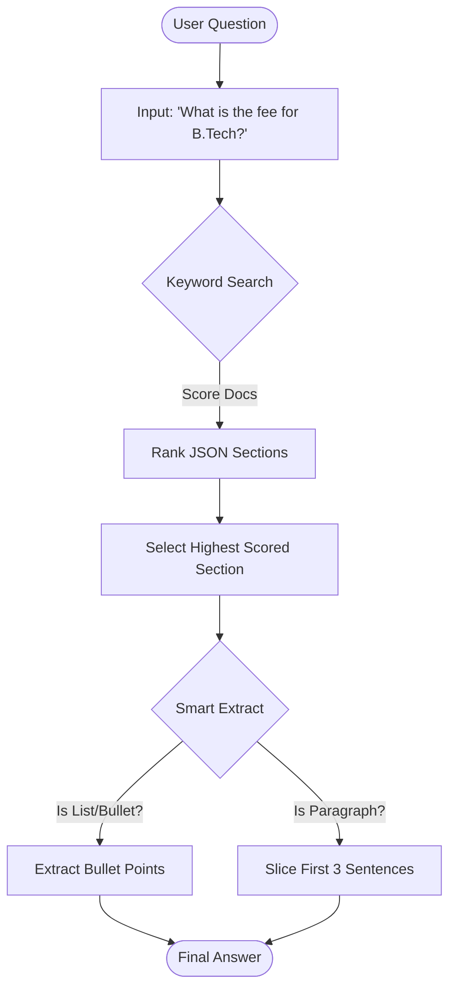

# Project Documentation: AI Campus Guide

This document provides a comprehensive overview of the AI Campus Guide project, detailing its architecture, data processing pipeline, and core logic.

---

## 1. System Architecture

The project follows a standard Full-Stack architecture with a Node.js backend and a React frontend.



---

## 2. Project Workflow

The system operates through three primary phases:

### Phase A: Knowledge Ingestion (Admin)
1.  **Login**: Admin logs into the dashboard.
2.  **Upload**: Admin uploads a campus document (PDF, DOCX, or TXT).
3.  **Processing**: The backend parses the file and converts it into a structured JSON knowledge base.
4.  **Indexing**: The data is stored in [knowledge_base.json](file:///d:/personal/chat_bot_project/backend/knowledge_base.json) for rapid retrieval.

### Phase B: Visitor Onboarding
1.  **Welcome**: The visitor is greeted by the AI.
2.  **Registration**: New visitors must provide their **Name** and **Mobile Number**.
3.  **Session**: Details are stored in the local database and browser `localStorage` to remember the visitor.

### Phase C: Interactive Chat
1.  **Query**: Visitor asks a question about the campus.
2.  **Retrieval**: The system searches the JSON knowledge base for the most relevant section.
3.  **Response**: The system extracts the specific answer and returns it to the visitor.

---

## 3. Document to JSON Conversion

This pipeline handles the transformation of unstructured documents into a queryable format.

### Logic Flow ([document.controller.js](file:///d:/personal/chat_bot_project/backend/controllers/document.controller.js) & [ai.service.js](file:///d:/personal/chat_bot_project/backend/services/ai.service.js))
1.  **Parsing**:
    - **PDF**: Uses `pdf-parse` to extract raw text markers.
    - **DOCX**: Uses `mammoth` to extract raw text without formatting overhead.
    - **TXT**: Direct string encoding.
2.  **Clearing**: The existing knowledge base is wiped to ensure data consistency ([clearStore](file:///d:/personal/chat_bot_project/backend/services/ai.service.js#57-62)).
3.  **Chunking**:
    - The system uses a specific regex `/\n\d+\.\s+/` to identify section headers (e.g., "1. About", "2. Courses").
    - The first line of each chunk is treated as the **Title**.
4.  **Storage**: Sections are saved as an array of objects in [backend/knowledge_base.json](file:///d:/personal/chat_bot_project/backend/knowledge_base.json):
    ```json
    [
      {
        "title": "admission process",
        "content": "1. Admission Process\nTo apply, visit the portal..."
      }
    ]
    ```

---

## 4. Question Answering Logic

The project uses a hybrid search and extraction mechanism to provide fast, accurate answers.

### Step 1: Keyword Search ([keywordSearch](file:///d:/personal/chat_bot_project/backend/services/ai.service.js#105-131))
The system calculates a "Relevance Score" for each section in the knowledge base:
- **Title Match**: +1000 points if the question contains the section title.
- **Word Match**: +200 points for matching words in the title, +20 points for words in the content.
- **Filtering**: Ignores common stop-words and short characters.

### Step 2: Smart Extraction ([smartLocalExtract](file:///d:/personal/chat_bot_project/backend/services/ai.service.js#132-170))
Once the best section is found, the system refines the content before showing it to the user:
- **List Detection**: If the question asks for "courses", "clubs", or "facilities", it extracts bullet points or numbered lists.
- **Sentence Slicing**: For general questions, it returns the first 2-3 meaningful sentences to keep the response concise.
- **Fallback**: If the OpenAI API is available and needed for complex reasoning, [basicChat](file:///d:/personal/chat_bot_project/backend/controllers/chat.controller.js#4-22) is invoked.

---

## 5. Flowchart: Request-Response Cycle



---

## 6. Database Schema Overview

| Table | Purpose |
| :--- | :--- |
| **Users** | Admin credentials and authentication. |
| **Visitors** | Stores visitor Name, Mobile, and ID for tracking. |
| **Conversations** | Logs every question and answer for analysis. |
| **Documents** | Metadata for uploaded files (filename, path). |
